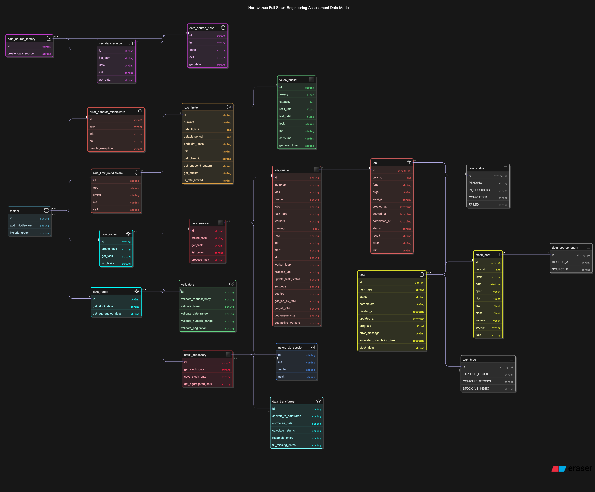

# Stock Analysis System Architecture

This document provides an overview of the system architecture and execution flow of the Stock Analysis backend application.

## Project Objective

The Stock Analysis application is designed to provide a robust platform for retrieving, processing, and visualizing stock market data from multiple sources. The system allows users to create data analysis tasks that pull information from different data sources (CSV files and external APIs), process this data through various transformations, and present meaningful insights through interactive visualizations.

Key objectives include:

1. **Data Integration**: Seamlessly combine stock data from multiple sources with a unified interface
2. **Asynchronous Processing**: Handle resource-intensive data operations without blocking API responses
3. **Flexible Analysis**: Support various types of stock analysis including single stock exploration, multi-stock comparison, and index benchmarking
4. **Interactive Visualization**: Present data through intuitive, interactive charts for better decision-making
5. **Scalable Architecture**: Design a system that can handle increasing data volumes and user requests

## System Architecture Diagram

## Key Components Explained

### 1. UML Design of Data Sources

The system implements a flexible data source abstraction with a common interface:

- **Abstract Data Source**: Defines common interface for all data sources
- **CSV Data Source**: Loads stock data from CSV files
- **API Data Source**: Retrieves data from external financial APIs
- **Database Data Source**: Fetches previously processed data from the database

This design allows for easy extension to new data sources while maintaining a consistent interface for data retrieval.

### 2. In-Memory Job Queue System

The application uses a thread-safe in-memory job queue for asynchronous task processing:

- **Job Queue**: Thread-safe queue for storing pending tasks
- **Thread Pool Executor**: Manages a pool of worker threads for concurrent task execution
- **Worker Threads**: Process tasks asynchronously without blocking the API
- **Task Status Tracking**: Real-time status updates for long-running tasks

This architecture ensures that resource-intensive operations don't block the API, providing a responsive user experience even during heavy data processing.

### 3. Data Loading and Processing

The data processing pipeline handles the entire lifecycle of stock data:

- **Data Loading**: Extracts data from various sources (CSV, API, DB)
- **Data Validation**: Ensures data integrity before processing
- **Data Transformation**: Converts raw data into structured formats (pandas DataFrames)
- **Data Storage**: Saves processed data to SQLite database for persistence

The system handles large datasets efficiently through chunked processing and optimized database operations.

### 4. Data Extraction and Caching

For improved performance, the system implements sophisticated data retrieval:

- **Database Queries**: Optimized SQL queries for efficient data retrieval
- **In-Memory Cache**: Stores frequently accessed data with Time-To-Live (TTL)
- **Cache Invalidation**: Automatically refreshes stale data
- **Query Optimization**: Uses indexes and query planning for fast data access

This approach significantly reduces database load and improves response times for repeated queries.

### 5. Data Filtering and Aggregation

The system provides powerful data analysis capabilities:

- **Filtering**: Filter by date range, ticker symbols, price ranges, etc.
- **Aggregation**: Group data by various time frequencies (daily, weekly, monthly)
- **OHLC Calculations**: Calculate Open-High-Low-Close values for aggregated periods
- **Custom Metrics**: Compute volume-weighted average prices, returns, etc.

These features enable sophisticated financial analysis directly through the API.

### 6. API Rate Limiting

To prevent abuse and ensure system stability:

- **Token Bucket Algorithm**: Allows for bursts of traffic while maintaining average limits
- **Client Identification**: Identifies clients by IP address or API key
- **Endpoint-Specific Limits**: Different limits for different endpoints based on resource usage
- **Retry Headers**: Provides clear feedback on when to retry after limits are exceeded

This implementation protects the system from excessive usage while providing a fair experience for all users.

### 7. Testing Driven Development

The application was developed using a test-driven approach:

- **Unit Tests**: Test individual components in isolation
- **Integration Tests**: Verify interactions between components
- **End-to-End Tests**: Test complete workflows from API to database
- **Performance Tests**: Ensure the system handles expected loads efficiently

This methodology ensures high code quality, reliable functionality, and easier maintenance.

## Execution Flow Example: Creating and Processing a Stock Data Task

1. **API Request**: Client sends a request to create a new stock data analysis task
2. **Request Validation**: Middleware validates the request format and parameters
3. **Rate Limiting Check**: System verifies the client hasn't exceeded their rate limit
4. **Task Creation**: A new task is created in the database with "PENDING" status
5. **Job Queuing**: Task is added to the in-memory job queue for processing
6. **Asynchronous Processing**: A worker thread picks up the task from the queue
7. **Data Source Selection**: System selects the appropriate data source based on task parameters
8. **Data Retrieval**: Worker fetches raw data from the selected source
9. **Data Transformation**: Raw data is transformed into a structured format
10. **Data Processing**: System applies requested transformations (normalization, resampling, etc.)
11. **Database Storage**: Processed data is stored in the database
12. **Status Update**: Task status is updated to "COMPLETED"
13. **Cache Update**: In-memory cache is updated with the new data
14. **Result Availability**: Client can now query the processed data through the API

This architecture ensures efficient processing, scalability, and a responsive user experience.
